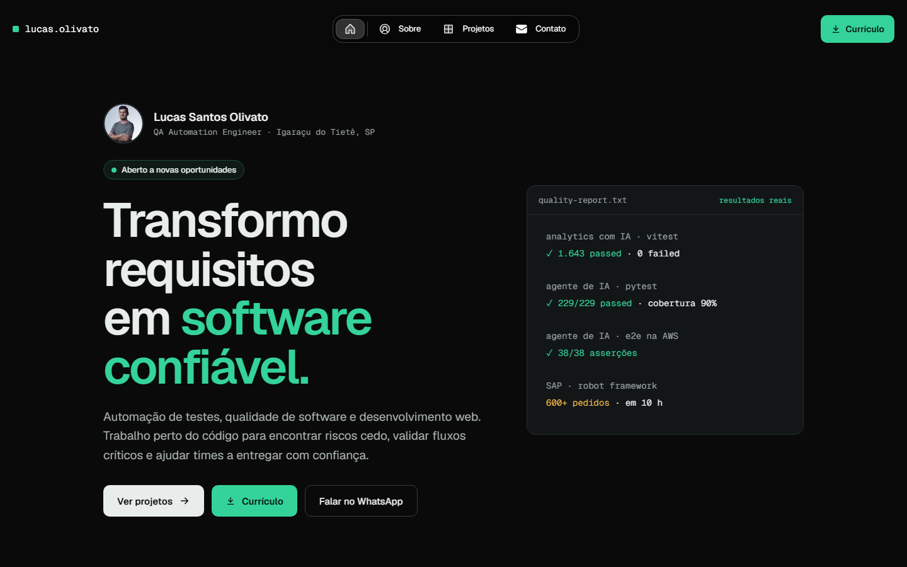

# lucasolivato.com

[](https://github.com/Lucasolivato/lucasolivato-portfolio/actions/workflows/ci.yml)
[](https://www.lucasolivato.com)

Portfólio de **Lucas Santos Olivato**, QA Automation Engineer e desenvolvedor de IA — escreve os testes e também constrói o que eles validam.

[](https://www.lucasolivato.com)

Este site é tratado como produto: tem requisitos, testes automatizados e um pipeline que bloqueia regressões.

## O que tem no site

| Página | Conteúdo |
|---|---|
| [Início](https://www.lucasolivato.com) | Quem sou, resultados reais de testes, estudos de caso em destaque, trajetória, ferramentas e contato. |
| [Projetos](https://www.lucasolivato.com/work) | Estudos de caso, produtos próprios e o estudo técnico deste portfólio. |
| [Sobre](https://www.lucasolivato.com/about) | Trajetória completa, como eu trabalho, experiência, formação e competências. |
| [Contato](https://www.lucasolivato.com/contact) | WhatsApp, e-mail, LinkedIn e GitHub. |

**Estudos de caso:**
[Agente pedagógico com persona histórica](https://www.lucasolivato.com/work/agente-ia-educacao) ·
[Assistente de IA que só responde com dados reais](https://www.lucasolivato.com/work/assistente-ia-analytics) ·
[VORCQ — gestão de locação de caçambas](https://www.lucasolivato.com/work/vorcq) ·
[600 pedidos em SAP para um teste de carga](https://www.lucasolivato.com/work/sap-automation) ·
[Qualidade aplicada a este portfólio](https://www.lucasolivato.com/work/portfolio-automation)

Todo número exibido no site vem de um repositório ou relatório real. Nada simula dados ao vivo — e há um teste garantindo isso.

## Qualidade

A suíte roda com **Playwright** em dois perfis — desktop (Chrome) e celular (Pixel 7) — a cada push, no GitHub Actions: **102 testes**.

| Suíte | O que garante |
|---|---|
| [`home.spec.ts`](tests/e2e/home.spec.ts) | Nome, cargo e proposta de valor na primeira dobra; currículo em PDF acessível; WhatsApp; estudos de caso em destaque. |
| [`navigation.spec.ts`](tests/e2e/navigation.spec.ts) | Toda página responde 200 com um único `h1`; o menu funciona; rotas inexistentes respondem 404 em português. |
| [`accessibility.spec.ts`](tests/e2e/accessibility.spec.ts) | Nenhuma violação séria ou crítica do **axe-core** (WCAG 2.1 A e AA) em nenhuma página. |
| [`layout.spec.ts`](tests/e2e/layout.spec.ts) | Nenhuma rolagem horizontal; botões principais com área de toque de 44 px ou mais; o fundo animado não bloqueia cliques nem aparece para leitores de tela. |
| [`seo.spec.ts`](tests/e2e/seo.spec.ts) | `lang`, descrição e Open Graph com o domínio real; `sitemap.xml`, `robots.txt`, favicon, manifest e imagem de compartilhamento válidos. |
| [`links.spec.ts`](tests/e2e/links.spec.ts) | Nenhum link interno quebrado. |

### Bugs que os testes pegaram

| Bug | Como foi encontrado |
|---|---|
| Páginas de demonstração do template publicadas em `/work` com o meu nome | Auditoria do site no ar |
| Domínio configurado era o da demo do template | Auditoria dos metadados |
| `sitemap.xml` respondendo 404 | Auditoria do site no ar |
| Qualquer `/work/<endereço>` respondia 200 (soft 404) | `navigation.spec.ts` |
| Texto dos botões com contraste de 1,1:1 por uma regra global do template | `accessibility.spec.ts` |
| Foto de perfil sem texto alternativo para leitores de tela | `accessibility.spec.ts` |
| Painel de "tempo real" com números fixos na Home | Revisão de conteúdo |

Cada um virou um teste de regressão.

## Rodando localmente

Requer Node.js 20.

```bash
npm install
npm run dev          # http://localhost:3000
```

Testes:

```bash
npm run build
npx playwright install chromium
npm run test:e2e     # sobe o build de produção e roda a suíte
```

Para testar o site publicado: `PLAYWRIGHT_BASE_URL=https://www.lucasolivato.com npm run test:e2e`.

## Stack

Next.js 15 (App Router) · React 19 · TypeScript · SCSS Modules · MDX para os estudos de caso · Geist · Playwright · axe-core · GitHub Actions · Vercel.

A base de componentes vem do [Magic Portfolio / Once UI](https://github.com/once-ui-system/magic-portfolio), sob a licença CC BY-NC 4.0 (veja [LICENSE](LICENSE)).

## Onde editar

| O quê | Onde |
|---|---|
| Textos, projetos, experiência e números | [`src/app/resources/content.tsx`](src/app/resources/content.tsx) |
| Estudos de caso | [`src/app/work/projects/*.mdx`](src/app/work/projects) |
| Home | [`src/app/page.tsx`](src/app/page.tsx) e [`src/components/home/`](src/components/home) |
| Linha de projeto (Home e Projetos) | [`src/components/work/ProjectRow.tsx`](src/components/work/ProjectRow.tsx) |
| Testes | [`tests/e2e/`](tests/e2e) — páginas novas entram em [`routes.ts`](tests/e2e/routes.ts) |
| Currículo em PDF | [`docs/curriculo/curriculo.html`](docs/curriculo/curriculo.html) → `npm run cv` gera [`public/Curriculo_Lucas_Olivato.pdf`](public/Curriculo_Lucas_Olivato.pdf) |
